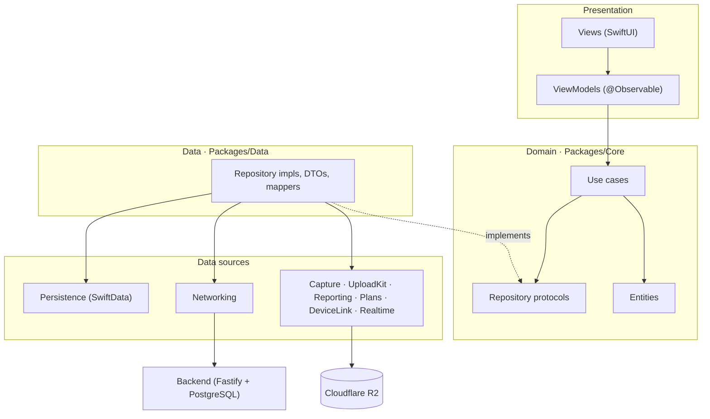
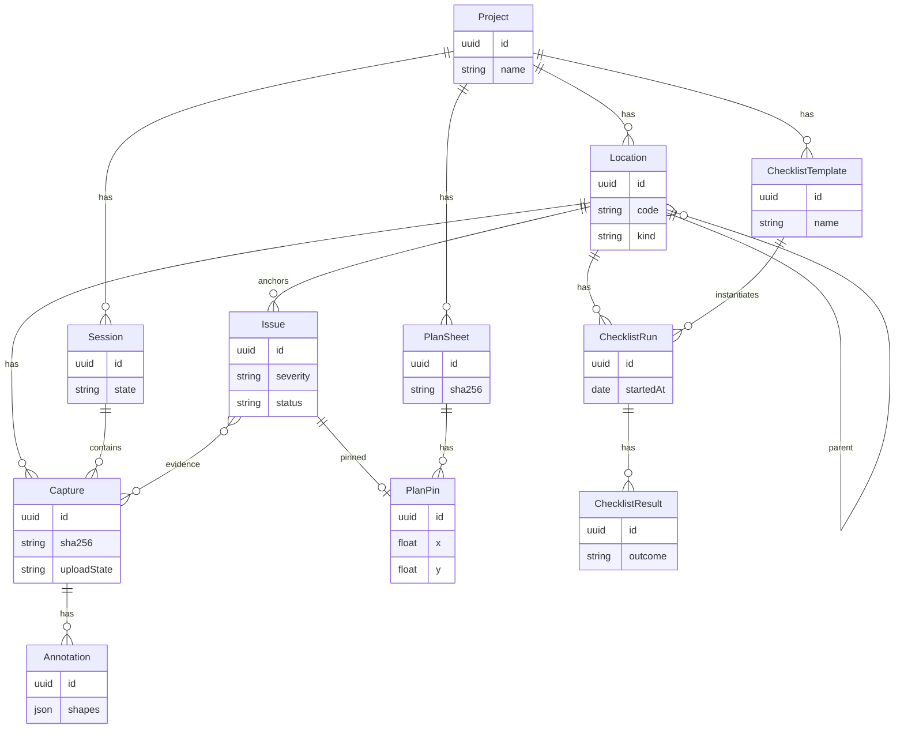

# SiteLog

| | |
|---|---|
| Overview | Offline-first iOS app for site supervisors to record construction site conditions and export a signed PDF inspection report |
| Last edit | 2026-09-30 |
| Author | Dam Hong Duc |
| Docs | [docs/index.md](docs/index.md) · build order in [ROADMAP.md](ROADMAP.md) |

## Store links

| Platform | Link |
|---|---|
| App Store | Not published |

## App IDs

| ID | Value |
|---|---|
| iOS bundle ID | `app.dd.site.log` |

## Tech stack

| Category | Technology | Version |
|---|---|---|
| Framework | SwiftUI | iOS 18.6 deployment target |
| Language | Swift | 6 (strict concurrency) |
| State management | Observation (`@Observable` view models, planned); `@State` in current code | iOS 17+ API |
| Backend | Node.js, TypeScript, Fastify, PostgreSQL (planned, not in repo yet) | Node 22, PostgreSQL 16 |
| Local DB | SwiftData (planned, not in repo yet) | iOS 18 |
| Special libraries | Inject (hot reload, Debug only) | 1.6.0 |

## Project architecture

| | |
|---|---|
| Architecture | Clean Architecture (Presentation · Domain · Data), MVVM in Presentation, SPM packages per layer |
| Encryption | Planned: Data Protection `.completeUnlessOpen` for media, AES-GCM for export bundles, HMAC-SHA256 audit chain, Keychain for keys and tokens |

Only `Packages/Core` exists today; the rest is specified in [00-project-info.md](docs/feature-docs/00-project-info.md) §4.

## Local database

Planned SwiftData schema from [00-project-info.md](docs/feature-docs/00-project-info.md) §3.

