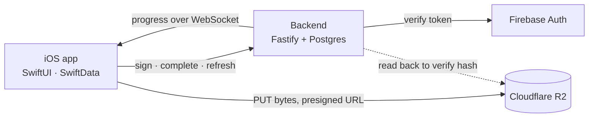

# SiteLog

Offline-first iOS app for recording construction site conditions. The deliverable is a signed PDF
inspection report with a verifiable chain of custody for every photo.

```
Create project → start survey session → walk floors and rooms, capture and log defects
→ reach WiFi, background upload → export a signed PDF report
```

Users: site supervisors, subcontractors, and apartment handover teams.

## Why it is built this way

Sites, basements, and alleys have weak signal or none. One survey produces **150–250 files and
several GB**. The user closes the app, pockets the phone, and keeps walking.

Every competitor in this category loses evidence the same three ways: uploads stall or complete
with photos missing, photos vanish on reload, and sync fails with nothing the user can act on.
SiteLog assumes the network is bad and is built around that assumption rather than against it.

| Constraint | Consequence |
|---|---|
| No signal for hours | Every write path completes offline |
| Multi-GB sessions | Transfers survive suspension, termination, and network loss |
| App killed in a pocket | No state lives only in RAM |
| The PDF is the paid deliverable | Never truncated, never silently missing an image |

## Architecture



Control, bytes, and state travel on three separate paths. The backend never sits in the data path,
so a slow backend cannot stall an upload.

## Hand-written on purpose

No SDK stands in for the parts that matter. Each of these is a deliberate trade of development
speed for depth:

| Component | Instead of | Why |
|---|---|---|
| **Upload engine** — background `URLSession`, S3 multipart, resume, retry | Firebase Storage `putFile()` | Cannot reattach to in-flight uploads after a cold launch, cannot control `isDiscretionary` or priority |
| **Capture pipeline** — `AVCaptureSession` + `AVAssetWriter`, streaming SHA-256 | `PhotosPicker` | A hash only means something for a file the app produced |
| **Sync engine** — revision cursors, tombstones, offline mutation queue | Firestore | Full control over conflict rules and delete propagation |
| **DeviceLink** — CoreBluetooth profiles for laser and moisture meters | Manual retyping | BLE for control and small values, WiFi for large files |

The upload state machine is pure and synchronous, so kill-mid-flight, expired presigned URLs, and a
failing final part are all testable without a network.

## Chain of custody

- `Capture` is immutable after creation; `sha256` is computed before the database write.
- Annotations are a separate vector layer, so marking up a photo never invalidates its hash.
- Every capture records clock provenance with a confidence level, because a device clock is
  user-settable.
- The report prints what actually happened — `registered` when the server recorded a hash,
  `verified` only after a worker read the object back and recomputed it.

## Stack

| Area | Choice |
|---|---|
| App | SwiftUI, SwiftData, Swift Concurrency, SPM modules · iOS 18+ |
| Media | AVFoundation, PDFKit, CryptoKit |
| Backend | Node 22, TypeScript, Fastify, PostgreSQL, raw SQL |
| Storage | Cloudflare R2, S3 multipart with presigned URLs |
| Identity | Firebase Auth and Crashlytics only |

## Documentation

Sixteen specifications covering product, market, architecture, data flows, every feature, the
backend contract, and a twelve-week plan.

Start at [docs/00-project-info.md](docs/00-project-info.md) · index in [docs/README.md](docs/README.md)

## Status

Specifications complete. Implementation starts at week 1; see
[docs/15-roadmap.md](docs/15-roadmap.md) for milestones and the task board.
