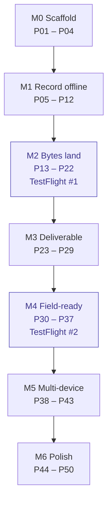

# Roadmap

Work is split into **parts, each with an hour estimate**. No calendar, no week numbers: do the
parts in order, tick them off, and a milestone is done when its demo runs on a real device.

Estimates are dev-hours for **one developer with 4 years of cross-platform mobile experience,
new to Swift and SwiftUI**. They include learning time: UI and architecture concepts transfer, but
SwiftUI state, SwiftData, background `URLSession`, CoreBluetooth and Xcode signing do not, so those
parts cost about twice a native developer's time. Backend parts carry no such penalty. Time the
first few parts, then scale the rest.

Detailed specs live in [`docs/feature-docs/`](docs/feature-docs/); the doc number is in `[brackets]`.

Parts tagged `[backend]` are Node.js + TypeScript work in `Backend/` ([14](docs/feature-docs/14-backend.md));
untagged parts are the iOS app.

49 open parts ≈ 351 hours (P01 already done). `M2` is the milestone that matters: everything before it is setup,
everything after it is addition. If `M5` is not reachable, stop after `M4` and ship single-device;
the schema and endpoints already allow adding sync later.

## M0 — Scaffold · 15h

Demo: every package builds on its own, CI is green, zero warnings.

- [x] **P01** Xcode project, XcodeGen, SwiftLint, hot reload, tooling
- [ ] **P02** `Core` package: logging, `AppDependencies` container, injected `Clock` [00] · **6h**
- [ ] **P03** Fastlane `test` lane and GitHub Actions PR checks [17] · **5h**
- [ ] **P04** CI guards: packages build standalone with warnings as errors, no `print(`, secret scan [17] · **4h**

## M1 — Record offline · 50h

Demo: project → 80 locations → photo captured and hashed, **in airplane mode**.

- [ ] **P05** Domain entities and SwiftData schema [00] · **8h**
- [ ] **P06** Schema versioning, migrations, store tests [00] · **8h**
- [ ] **P07** Projects: list and create [01] · **6h**
- [ ] **P08** Sessions: start, resume, and the location list [01] · **6h**
- [ ] **P09** Import 80 locations offline [01] · **5h**
- [ ] **P10** Capture: camera session and permissions [02] · **8h**
- [ ] **P11** Capture: write to disk and SHA-256 hash [02] · **5h**
- [ ] **P12** Capture: metadata linked to a location, airplane-mode demo [02] · **4h**

## M2 — Bytes land · TestFlight #1 · 77h

Demo: 200 files reach storage and survive app kill and airplane mode.

- [ ] **P13** `[backend]` Backend skeleton and first migrations [14] · **6h**
- [ ] **P14** `[backend]` Presigned upload endpoint and object storage [14] · **5h**
- [ ] **P15** `[backend]` Complete and status endpoints [14] · **4h**
- [ ] **P16** `UploadKit`: job model and local store [04] · **6h**
- [ ] **P17** `UploadKit`: single PUT through a background `URLSession` [04] · **10h**
- [ ] **P18** `UploadKit`: state machine, retry, backoff [04] · **6h**
- [ ] **P19** `UploadKit`: multipart and resume [04] · **14h**
- [ ] **P20** `UploadKit`: kill and relaunch reconciliation [04] · **10h**
- [ ] **P21** Network policy (Wi-Fi only) and upload-URL refresh [04] · **6h**
- [ ] **P22** Signing, App Store Connect API key, first TestFlight build [17] · **10h**

## M3 — Deliverable · 52h

Demo: a signed, branded PDF and a CSV exported from a real session.

- [ ] **P23** Face ID lock and Keychain storage [07] · **6h**
- [ ] **P24** Audit chain [07] · **5h**
- [ ] **P25** Annotation model and drawing layer [12] · **10h**
- [ ] **P26** Trusted time and the stamped derivative [12] · **8h**
- [ ] **P27** Report data model and CSV export [05] · **5h**
- [ ] **P28** PDF renderer [05] · **12h**
- [ ] **P29** Signature, branding, share sheet [05] · **6h**

## M4 — Field-ready · TestFlight #2 · 62h

Demo: pins on a real floor plan, checklists, BLE mock, diagnostics.

- [ ] **P30** Floor plan import and viewer [11] · **10h**
- [ ] **P31** Pin placement and persistence [11] · **8h**
- [ ] **P32** Checklist templates [13] · **6h**
- [ ] **P33** Checklist run and results [13] · **6h**
- [ ] **P34** DeviceLink protocol and BLE mock [06] · **14h**
- [ ] **P35** Diagnostics: upload status screen [09] · **6h**
- [ ] **P36** Diagnostics: storage breakdown, cleanup, diagnostic bundle [09] · **6h**
- [ ] **P37** Crash reporting, first Instruments pass, TestFlight build [09] [19] · **6h**

## M5 — Multi-device · 50h

Demo: a second device sees the same data and deletes propagate.

- [ ] **P38** Sign-in (OAuth/OIDC) and token refresh [08] (app side; server-side token check is in `Backend/`) · **10h**
- [ ] **P39** `[backend]` Backend pull and push endpoints [14] · **6h**
- [ ] **P40** Sync engine: pull [08] · **8h**
- [ ] **P41** Sync engine: push and conflict rules [08] · **12h**
- [ ] **P42** Deletes propagate (tombstones) [08] · **6h**
- [ ] **P43** Two-device convergence test [08] · **8h**

## M6 — Polish · 45h

Demo: realtime state, push, deep links, accessibility, ready for submission.

- [ ] **P44** Realtime client: connect, auth, ping, reconnect [10] · **6h**
- [ ] **P45** Realtime events reconciled into the upload store [10] · **6h**
- [ ] **P46** `[backend]` Verification worker [14] · **6h**
- [ ] **P47** Push notifications [18] · **6h**
- [ ] **P48** Deep links [18] · **3h**
- [ ] **P49** Accessibility pass (Dynamic Type, VoiceOver, contrast) · **8h**
- [ ] **P50** Instruments budgets, TestFlight feedback closed, submission prep [19] [17] · **10h**

## Rules

1. A part ends with something runnable or a passing test, never "half a screen".
2. A part estimated above 8h (`P17`, `P19`, `P20`, `P22`, `P25`, `P28`, `P30`, `P34`, `P38`, `P41`,
   `P50`) is split when you start it. If any part runs long, split it and renumber; do not let it
   swallow the next one.
3. Tick the box in the same commit that finishes the part.
4. Order is by dependency: `P22` needs `P13`–`P21`, `P28` needs `P26`, `P44` needs `P38`–`P43`.
