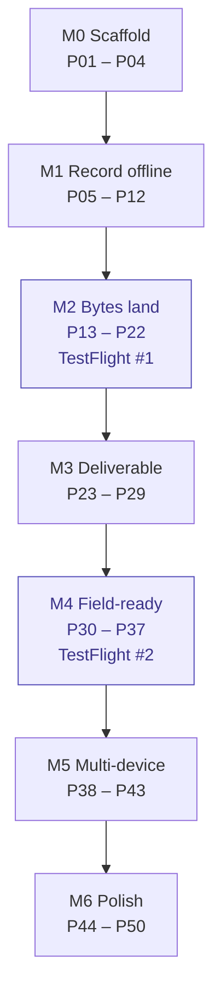

# Roadmap

Work is split into parts, done in order. A milestone is done when its demo runs on a real device.

Format: `PXX - [docs-number] - [context] - [est hours] - description`.

- `[docs-number]` is the spec in `docs/feature-docs/` (`-` if none).
- `[Backend]` parts are Node.js work in `Backend/`; every other context is the iOS app.

Estimates are dev-hours for one developer new to Swift and SwiftUI, learning time included. Time the
first few parts, then scale the rest.

| | |
|---|---|
| Total | 49 open parts ≈ 351 hours (`P01` done) |
| Key milestone | `M2`: everything before it is setup, everything after it is addition |
| Stop rule | If `M5` is not reachable, stop after `M4` and ship single-device; sync can be added later |

## M0 — Scaffold · 15h

Demo: every package builds on its own, CI is green, zero warnings.

- [x] **P01** - [-] - [Tooling] - [done] - Xcode project, XcodeGen, SwiftLint, hot reload, tooling
- [ ] **P02** - [00] - [Core] - [6h] - `Core` package: logging, `AppDependencies` container, injected `Clock`
- [ ] **P03** - [17] - [CI] - [5h] - Fastlane `test` lane and GitHub Actions PR checks
- [ ] **P04** - [17] - [CI] - [4h] - CI guards: packages build standalone with warnings as errors, no `print(`, secret scan

## M1 — Record offline · 50h

Demo: project → 80 locations → photo captured and hashed, **in airplane mode**.

- [ ] **P05** - [00] - [Persistence] - [8h] - Domain entities and SwiftData schema
- [ ] **P06** - [00] - [Persistence] - [8h] - Schema versioning, migrations, store tests
- [ ] **P07** - [01] - [Projects] - [6h] - Projects: list and create
- [ ] **P08** - [01] - [Sessions] - [6h] - Sessions: start, resume, and the location list
- [ ] **P09** - [01] - [Locations] - [5h] - Import 80 locations offline
- [ ] **P10** - [02] - [Capture] - [8h] - Capture: camera session and permissions
- [ ] **P11** - [02] - [Capture] - [5h] - Capture: write to disk and SHA-256 hash
- [ ] **P12** - [02] - [Capture] - [4h] - Capture: metadata linked to a location, airplane-mode demo

## M2 — Bytes land · TestFlight #1 · 77h

Demo: 200 files reach storage and survive app kill and airplane mode.

- [ ] **P13** - [14] - [Backend] - [6h] - Backend skeleton and first migrations
- [ ] **P14** - [14] - [Backend] - [5h] - Presigned upload endpoint and object storage
- [ ] **P15** - [14] - [Backend] - [4h] - Refresh, complete and abort endpoints
- [ ] **P16** - [04] - [UploadKit] - [6h] - `UploadKit`: job model and local store
- [ ] **P17** - [04] - [UploadKit] - [10h] - `UploadKit`: single PUT through a background `URLSession`
- [ ] **P18** - [04] - [UploadKit] - [6h] - `UploadKit`: state machine, retry, backoff
- [ ] **P19** - [04] - [UploadKit] - [14h] - `UploadKit`: multipart and resume
- [ ] **P20** - [04] - [UploadKit] - [10h] - `UploadKit`: kill and relaunch reconciliation
- [ ] **P21** - [04] - [UploadKit] - [6h] - Network policy (Wi-Fi only) and upload-URL refresh
- [ ] **P22** - [17] - [Release] - [10h] - Signing, App Store Connect API key, first TestFlight build

## M3 — Deliverable · 52h

Demo: a signed, branded PDF and a CSV exported from a real session.

- [ ] **P23** - [07] - [Security] - [6h] - Face ID lock and Keychain storage
- [ ] **P24** - [07] - [Security] - [5h] - Audit chain
- [ ] **P25** - [12] - [Annotation] - [10h] - Annotation model and drawing layer
- [ ] **P26** - [12] - [Annotation] - [8h] - Trusted time and the stamped derivative
- [ ] **P27** - [05] - [Reporting] - [5h] - Report data model and CSV export
- [ ] **P28** - [05] - [Reporting] - [12h] - PDF renderer
- [ ] **P29** - [05] - [Reporting] - [6h] - Signature, branding, share sheet

## M4 — Field-ready · TestFlight #2 · 62h

Demo: pins on a real floor plan, checklists, BLE mock, diagnostics.

- [ ] **P30** - [11] - [Plans] - [10h] - Floor plan import and viewer
- [ ] **P31** - [11] - [Plans] - [8h] - Pin placement and persistence
- [ ] **P32** - [13] - [Checklists] - [6h] - Checklist templates
- [ ] **P33** - [13] - [Checklists] - [6h] - Checklist run and results
- [ ] **P34** - [06] - [DeviceLink] - [14h] - DeviceLink protocol and BLE mock
- [ ] **P35** - [09] - [Diagnostics] - [6h] - Diagnostics: upload status screen
- [ ] **P36** - [09] - [Diagnostics] - [6h] - Diagnostics: storage breakdown, cleanup, diagnostic bundle
- [ ] **P37** - [09,19] - [Diagnostics] - [6h] - Crash reporting, first Instruments pass, TestFlight build

## M5 — Multi-device · 50h

Demo: a second device sees the same data and deletes propagate.

- [ ] **P38** - [08] - [Auth] - [10h] - Firebase Auth sign-in (Apple, email) and ID-token handling (server-side check is in `P13`)
- [ ] **P39** - [14] - [Backend] - [6h] - Backend pull and push endpoints
- [ ] **P40** - [08] - [Sync] - [8h] - Sync engine: pull
- [ ] **P41** - [08] - [Sync] - [12h] - Sync engine: push and conflict rules
- [ ] **P42** - [08] - [Sync] - [6h] - Deletes propagate (tombstones)
- [ ] **P43** - [08] - [Sync] - [8h] - Two-device convergence test

## M6 — Polish · 45h

Demo: realtime state, push, deep links, accessibility, ready for submission.

- [ ] **P44** - [10] - [Realtime] - [6h] - Realtime client: connect, auth, ping, reconnect
- [ ] **P45** - [10] - [Realtime] - [6h] - Realtime events reconciled into the upload store
- [ ] **P46** - [14] - [Backend] - [6h] - Verification worker
- [ ] **P47** - [18] - [Push] - [6h] - Push notifications
- [ ] **P48** - [18] - [DeepLinks] - [3h] - Deep links
- [ ] **P49** - [-] - [Accessibility] - [8h] - Accessibility pass (Dynamic Type, VoiceOver, contrast)
- [ ] **P50** - [19,17] - [Release] - [10h] - Instruments budgets, TestFlight feedback closed, submission prep

## Rules

1. A part ends with something runnable or a passing test, never "half a screen".
2. A part estimated above 8h (`P17`, `P19`, `P20`, `P22`, `P25`, `P28`, `P30`, `P34`, `P38`, `P41`,
   `P50`) is split when you start it. If any part runs long, split it and renumber; do not let it
   swallow the next one.
3. Tick the box in the same commit that finishes the part.
4. Order is by dependency: `P22` needs `P13`–`P21`, `P28` needs `P26`, `P44` needs `P38`–`P43`.
