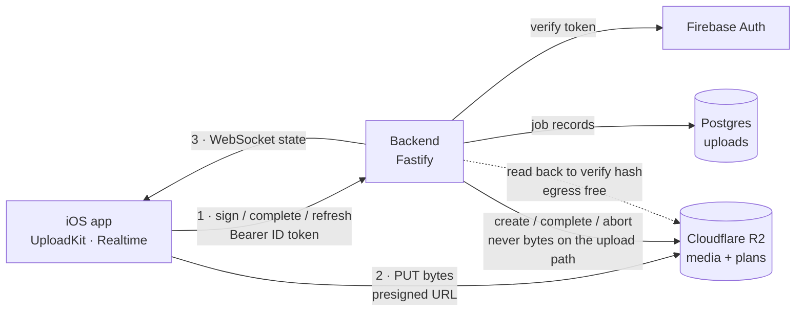
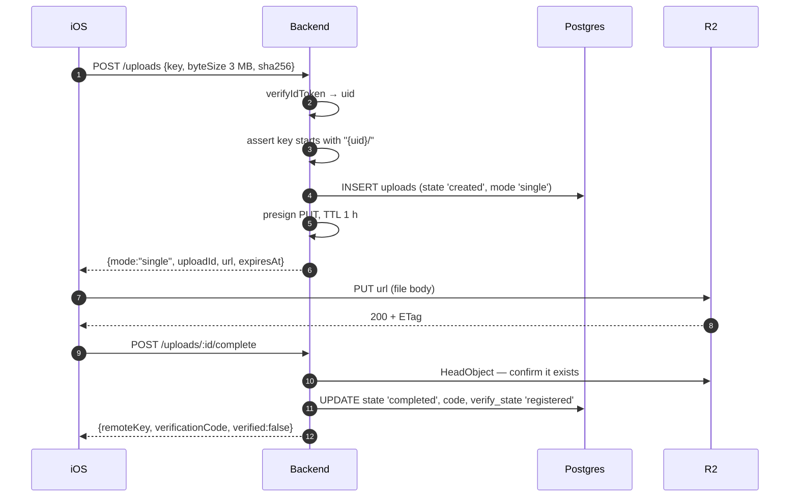
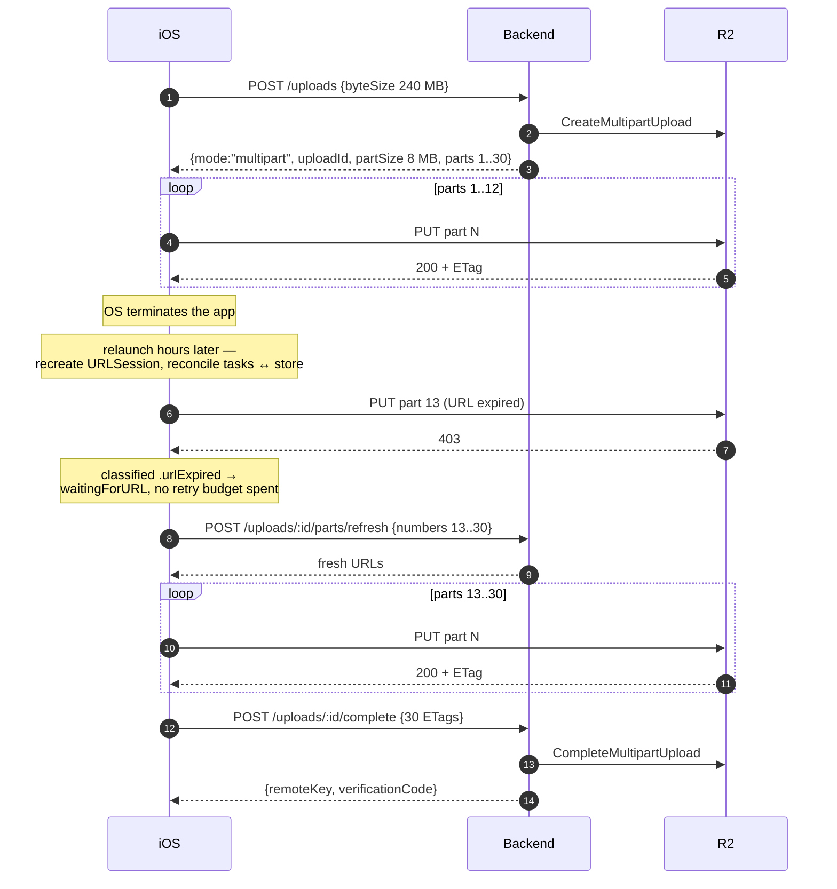
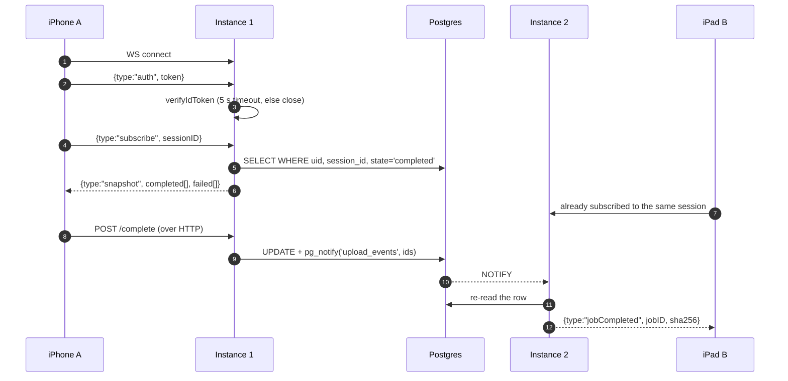
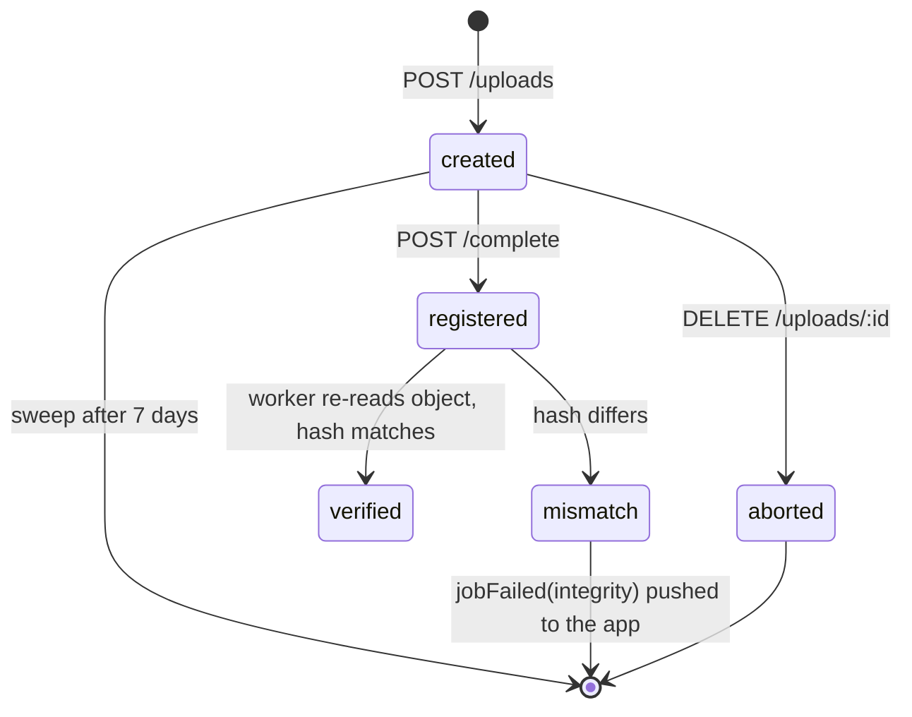
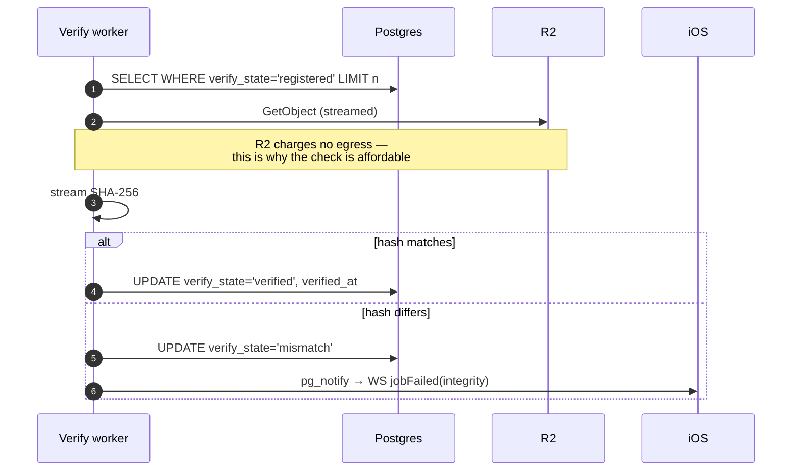
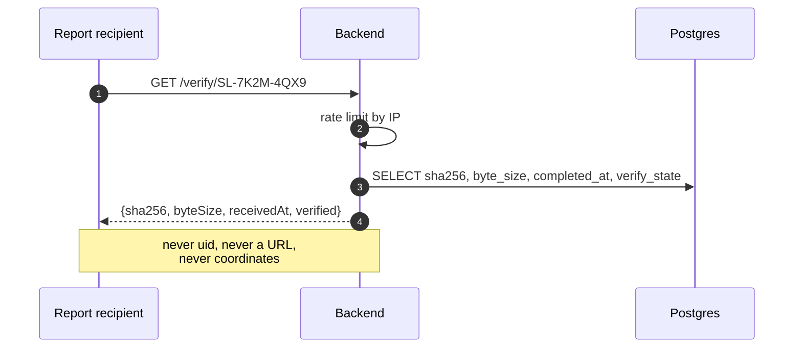
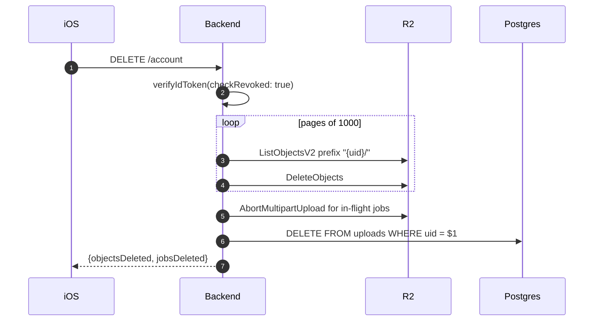

# 14 — Backend

Directory: `Backend/` · Node.js + TypeScript

The backend signs URLs, owns **all** application data, and pushes state. There is no Firestore:
Firebase provides identity and crash reporting only ([08](08-auth-sync.md)).

**Contents** — 1. [Role](#1-role) · 2. [Stack](#2-stack) · 3. [Endpoints](#3-endpoints) · 4. [Auth](#4-auth) · 5. [Key namespace](#5-key-namespace) · 6. [Database](#6-database) · 7. [Sync](#7-sync) · 8. [Operation flows](#8-operation-flows) · 9. [Integrity — the honest position](#9-integrity--the-honest-position) · 10. [WebSocket](#10-websocket) · 11. [Error contract](#11-error-contract) · 12. [Trusted time](#12-trusted-time) · 13. [R2 configuration](#13-r2-configuration) · 14. [Config](#14-config) · 15. [Operational rules](#15-operational-rules) · 16. [Definition of done](#16-definition-of-done) · 17. [Tests](#17-tests)

## 1. Role

| Does | Does not |
|---|---|
| Verify Firebase ID tokens | Proxy or buffer file bytes |
| Create/sign/refresh/abort R2 multipart uploads | Render reports |
| Sign single PUT URLs for small files | Own business rules — the app decides, the server records |
| Store every metadata row and serve delta sync | Authenticate users itself — Firebase does that |
| Record job state and countersign capture hashes | |
| Serve the WebSocket progress channel ([10](10-realtime-progress.md)) | |
| Resolve verification codes for report recipients | |
| Delete R2 objects and rows on account deletion | |

Earlier drafts called this "~100 lines". That was wrong twice over: the WebSocket channel,
verification, and now the full sync surface each add real weight. Expect
**~1800–2500 lines of TypeScript**.

## 2. Stack

| Concern | Choice | Why |
|---|---|---|
| Runtime | Node 22 LTS, TypeScript, ESM | |
| HTTP | Fastify | Schema-first validation, faster than Express, `@fastify/websocket` wraps `ws` cleanly |
| Validation | TypeBox (Fastify-native) or Zod | Every request body validated at the edge; reject before touching R2 |
| R2 | `@aws-sdk/client-s3` + `@aws-sdk/s3-request-presigner` | R2 is S3-compatible; presigning is client-side crypto, no network call |
| Token verification | `firebase-admin` | One call, handles key rotation and caching |
| Database | **PostgreSQL 16** | |
| DB driver | `pg` (node-postgres), **raw parameterized SQL** | No ORM, no query builder — the schema is small and SQL is the interface |
| Migrations | Numbered `.sql` files + `node-pg-migrate` | Plain SQL forward and back; reviewable in a diff |
| Tests | `vitest` + `aws-sdk-client-mock` + a throwaway Postgres | |
| Deploy | Fly.io or Railway, Postgres alongside | A long-lived process is required for WebSocket |

**Not Cloudflare Workers**, despite R2 being Cloudflare: `firebase-admin` needs Node APIs, and
WebSocket on Workers requires Durable Objects. If the backend later moves to the edge, swap
`firebase-admin` for `jose` + Google's public keys and budget for that rewrite deliberately.

## 3. Endpoints

| # | Method | Path | Auth | Purpose |
|---|---|---|---|---|
| 1 | `POST` | `/uploads` | Bearer | Begin an upload — returns single-PUT or multipart plan |
| 2 | `POST` | `/uploads/:id/parts/refresh` | Bearer | Re-sign expired part URLs |
| 3 | `POST` | `/uploads/:id/complete` | Bearer | Complete multipart, record the job, return `remoteKey` + code |
| 4 | `DELETE` | `/uploads/:id` | Bearer | Abort, clean orphaned parts |
| 5 | `POST` | `/sync/pull` | Bearer | Delta pull since a revision cursor |
| 6 | `POST` | `/sync/push` | Bearer | Apply a batch of client mutations |
| 7 | `GET` | `/verify/:code` | **none** | Resolve a verification code printed in a report |
| 8 | `DELETE` | `/account` | Bearer | Delete every R2 object and row for the caller |
| 9 | `GET` | `/health` | none | Liveness |
| — | `WS` | `/ws` | first message | Progress channel |

### 1. `POST /uploads`

The client does not know which mode it will get; the backend decides from `byteSize`.

```jsonc
// request
{ "key": "…", "byteSize": 3145728, "contentType": "image/jpeg", "sha256": "…" }

// response — small file
{ "mode": "single", "uploadId": "job_01H…", "url": "https://…", "expiresAt": "…" }

// response — large file
{ "mode": "multipart", "uploadId": "…", "partSizeBytes": 8388608,
  "parts": [{ "number": 1, "url": "https://…", "expiresAt": "…" }] }
```

- Threshold matches `UploadConstants.singlePutThresholdBytes` (5 MB). **Both sides must agree**;
  the value lives in `xcconfig` and in backend config, and a mismatch shows up as wasted round trips.
- Presigned TTL: `presignTTL` (1 h). Longer TTLs are not a fix for expiry — refresh is
  ([04](04-upload-engine.md)).
- `uploadId` in `single` mode is a backend job id, not an S3 upload id. The client keys on it either way.

### 2. `POST /uploads/:id/parts/refresh`

```jsonc
{ "numbers": [3, 4, 5] }   →   { "parts": [{ "number": 3, "url": "…", "expiresAt": "…" }] }
```

Mandatory. The core scenario is an app killed and reopened hours later, when every signed URL has
expired and resume would otherwise 403 across the board.

### 3. `POST /uploads/:id/complete`

```jsonc
{ "parts": [{ "number": 1, "etag": "\"abc\"" }] }
→ { "remoteKey": "…", "verificationCode": "SL-7K2M-4QX9", "verified": false }
```

- Calls `CompleteMultipartUpload` (multipart) or `HeadObject` (single) to confirm the object exists.
- **Must be idempotent.** A client killed before reading the response will call it again. Keyed on
  `uploadId`, a repeat returns the original `200` body — never `400`, which the client treats as
  permanent and aborts on ([04](04-upload-engine.md) failure table).
- Writes the job record and enqueues verification (below).

### 7. `GET /verify/:code`

```jsonc
{ "sha256": "…", "byteSize": 4194304, "receivedAt": "…",
  "verified": true, "verifiedAt": "…", "projectRef": "Ánh Dương Tower" }
```

- **Unauthenticated by design** — the recipient of a PDF has no account. That makes it the most
  abusable surface in the system.
- Returns **no** media, no signed URL, no uid, no coordinates. Only what proves the hash was
  registered.
- Codes are 10+ random characters from an unambiguous alphabet, never sequential.
- Rate limited per IP; unknown codes return `404` after the same delay as a hit, so the endpoint
  cannot be used to enumerate.

### 8. `DELETE /account`

Required for App Store compliance ([08](08-auth-sync.md)). The app cannot do this itself — it never
holds R2 credentials.

- Lists and deletes everything under `{uid}/` in pages of 1000.
- Aborts any in-flight multipart uploads for that uid.
- Deletes every row for that uid: `uploads` and all metadata tables, in one transaction.
- Returns counts, so the app can show what was removed.
- Idempotent; safe to retry after a timeout.

## 4. Auth

```ts
async function requireUser(req: FastifyRequest): Promise<{ uid: string }> {
  const header = req.headers.authorization
  if (!header?.startsWith('Bearer ')) throw unauthorized()
  const decoded = await getAuth().verifyIdToken(header.slice(7), true) // checkRevoked
  return { uid: decoded.uid }
}
```

| Rule | Reason |
|---|---|
| Verify on **every** request, including refresh and complete | A revoked token must stop working immediately |
| `checkRevoked: true` | Password change on another device must invalidate |
| Never trust `key` from the body | Enforce `key.startsWith(`${uid}/`)` — without it the signer is an open relay into the bucket |
| Reject keys containing `..` or absolute paths | Prefix checks are bypassable by traversal |
| Return `401`, never `403`, for auth failures | The client maps `401` to token refresh; `403` means the presigned URL expired |

## 5. Key namespace

```
{uid}/{projectID}/{sessionID}/{captureID}.{ext}
{uid}/{projectID}/plans/{sheetID}.{ext}
```

Validated with a strict regex, not a `startsWith` alone. Reject anything that does not match the
full shape.

## 6. Database

**16 tables** created by migrations — one for uploads, one sync counter, and 14 synced entities —
plus `pgmigrations`, which the migration tool owns. Migrations are numbered `.sql` files under
`Backend/migrations/`.

| File | Contents |
|---|---|
| `0001_uploads.sql` | `uploads` + upload enums |
| `0002_sync_core.sql` | `sync_state` |
| `0003_metadata.sql` | All entity tables + entity enums |

### 6.1 Shared shape

Every synced table carries the same five columns. They are the sync protocol
([08](08-auth-sync.md)), not business data.

| Column | Type | Purpose |
|---|---|---|
| `id` | `uuid` PK | **Client-generated** — a row created offline already has its final identity |
| `uid` | `text` | Owner; every query filters on it |
| `rev` | `bigint` | Server-assigned pull cursor |
| `client_updated_at` | `timestamptz` | LWW input |
| `deleted_at` | `timestamptz` | Tombstone; `null` means live |

Each gets `create index <t>_pull on <t> (uid, rev);` — the only index the pull query needs.

### 6.2 `0001_uploads.sql`

The upload job is the one row the client never authors.

```sql
-- migrations/0001_uploads.sql
create type upload_mode  as enum ('single', 'multipart');
create type upload_state as enum ('created', 'completed', 'aborted');
create type verify_state as enum ('registered', 'verified', 'mismatch');

create table uploads (
    id                uuid         primary key default gen_random_uuid(),
    uid               text         not null,
    session_id        uuid         not null,
    capture_id        uuid,        -- links the code back to the capture row
    object_key        text         not null,
    sha256            char(64)     not null,
    byte_size         bigint       not null check (byte_size > 0),
    content_type      text         not null,
    mode              upload_mode  not null,
    s3_upload_id      text,
    state             upload_state not null default 'created',
    verification_code text         unique,
    verify_state      verify_state,
    verified_at       timestamptz,
    created_at        timestamptz  not null default now(),
    completed_at      timestamptz,

    constraint multipart_needs_s3_id
        check (mode <> 'multipart' or s3_upload_id is not null),
    constraint completed_needs_code
        check (state <> 'completed' or verification_code is not null)
);

-- one completed object per key per user; retries reuse the row
create unique index uploads_completed_key
    on uploads (uid, object_key) where state = 'completed';

-- serves the WebSocket snapshot in one query
create index uploads_snapshot on uploads (uid, session_id, state);

-- sweep of abandoned uploads
create index uploads_abandoned on uploads (created_at) where state = 'created';
```

| Choice | Reason |
|---|---|
| `timestamptz` everywhere, never `timestamp` | The client derives clock offset from this service; an ambiguous zone corrupts it |
| `char(64)` for `sha256` | Fixed width, indexable, comparable as text |
| `bigint` for `byte_size` | `int` overflows at 2 GB, and video files reach it |
| Enums, not free text | An invalid state becomes a write error, not a silent bug |
| `verification_code` is a column with a unique index | Postgres gives the lookup index for free — no second lookup table |
| Partial indexes | The table is mostly `completed` rows; unqualified indexes would be wasted |
| No `parts` table | Refresh only needs `s3_upload_id` and the part numbers the client asks for; `complete` carries the ETags |

### 6.3 `0002_sync_core.sql`

```sql
create table sync_state (
    uid        text        primary key,
    last_rev   bigint      not null default 0,
    created_at timestamptz not null default now()
);
```

One row per user. Every mutating transaction runs

```sql
update sync_state set last_rev = last_rev + 1 where uid = $1 returning last_rev;
```

first, and stamps the returned value onto every row it writes.

**This is the load-bearing detail of the whole sync design.**

| Approach | Outcome |
|---|---|
| `nextval()` sequence | Two transactions allocate revs 7 and 8 and commit in the opposite order — a client polling `rev > 7` **never sees row 7** |
| `update sync_state … returning` | Takes a row lock on that user's row, serialising all of their writes — revs become gap-free *and* commit-ordered |

Serialising per user costs nothing: one person writes at human speed.

### 6.4 `0003_metadata.sql`

```sql
create type session_state     as enum ('draft','active','closed','exported');
create type location_kind     as enum ('floor','unit','room');
create type capture_kind      as enum ('photo','video','audio');
create type time_confidence   as enum ('serverVerified','sessionConsistent','deviceOnly');
create type issue_severity    as enum ('critical','major','minor');
create type issue_status      as enum ('open','inProgress','resolved','verified');
create type checklist_outcome as enum ('pass','fail','notApplicable','unanswered');

create table projects (
    id uuid primary key, uid text not null, rev bigint not null,
    client_updated_at timestamptz not null, deleted_at timestamptz,
    name        text not null,
    address     text not null default '',
    client_name text not null default '',
    created_at  timestamptz not null
);

create table locations (
    id uuid primary key, uid text not null, rev bigint not null,
    client_updated_at timestamptz not null, deleted_at timestamptz,
    project_id uuid not null references projects(id)  on delete cascade deferrable initially deferred,
    parent_id  uuid          references locations(id) on delete cascade deferrable initially deferred,
    code       text not null,
    kind       location_kind not null,
    sort_index int not null default 0
);
create unique index locations_code on locations (project_id, code) where deleted_at is null;

create table plan_sheets (
    id uuid primary key, uid text not null, rev bigint not null,
    client_updated_at timestamptz not null, deleted_at timestamptz,
    project_id   uuid not null references projects(id)  on delete cascade deferrable initially deferred,
    location_id  uuid          references locations(id) on delete set null deferrable initially deferred,
    name         text not null,
    page_index   int  not null default 0,
    pixel_width  int  not null,
    pixel_height int  not null,
    sha256       char(64) not null,
    remote_key   text
);

create table sessions (
    id uuid primary key, uid text not null, rev bigint not null,
    client_updated_at timestamptz not null, deleted_at timestamptz,
    project_id    uuid not null references projects(id) on delete cascade deferrable initially deferred,
    started_at    timestamptz not null,
    ended_at      timestamptz,
    surveyor_name text not null default '',
    note          text not null default '',
    state         session_state not null default 'draft'
);

create table captures (
    id uuid primary key, uid text not null, rev bigint not null,
    client_updated_at timestamptz not null, deleted_at timestamptz,
    project_id  uuid not null references projects(id)  on delete cascade deferrable initially deferred,
    session_id  uuid not null references sessions(id)  on delete cascade deferrable initially deferred,
    location_id uuid          references locations(id) on delete set null deferrable initially deferred,
    kind        capture_kind not null,
    sha256      char(64) not null,
    byte_size   bigint   not null check (byte_size > 0),
    captured_at timestamptz not null,
    time_confidence     time_confidence not null,
    latitude            double precision,
    longitude           double precision,
    horizontal_accuracy double precision,
    device_model        text not null,
    duration_seconds    double precision,
    remote_key          text,
    excluded_from_report boolean not null default false,
    constraint coords_paired check ((latitude is null) = (longitude is null))
);
create unique index captures_dedupe on captures (project_id, sha256) where deleted_at is null;

create table annotations (
    capture_id uuid primary key references captures(id) on delete cascade deferrable initially deferred,
    uid text not null, rev bigint not null,
    client_updated_at timestamptz not null, deleted_at timestamptz,
    shapes jsonb not null default '[]'
);

create table issues (
    id uuid primary key, uid text not null, rev bigint not null,
    client_updated_at timestamptz not null, deleted_at timestamptz,
    project_id  uuid not null references projects(id)   on delete cascade deferrable initially deferred,
    location_id uuid not null references locations(id)  on delete cascade deferrable initially deferred,
    title    text not null,
    detail   text not null default '',
    severity issue_severity not null,
    status   issue_status   not null default 'open',
    due_date date,
    assignee_name text,
    trade         text,
    plan_sheet_id uuid references plan_sheets(id) on delete set null deferrable initially deferred,
    pin_x double precision,
    pin_y double precision,
    resolved_by_issue_id       uuid references issues(id) on delete set null deferrable initially deferred,
    source_checklist_result_id uuid,
    constraint pin_all_or_none check (num_nonnulls(plan_sheet_id, pin_x, pin_y) in (0, 3)),
    constraint pin_normalized  check (pin_x is null or (pin_x between 0 and 1 and pin_y between 0 and 1))
);
create index issues_open_at_location on issues (location_id, status) where deleted_at is null;

create table issue_captures (
    issue_id   uuid not null references issues(id)   on delete cascade deferrable initially deferred,
    capture_id uuid not null references captures(id) on delete cascade deferrable initially deferred,
    uid text not null, rev bigint not null,
    client_updated_at timestamptz not null, deleted_at timestamptz,
    primary key (issue_id, capture_id)
);

create table checklist_templates (
    id uuid primary key, uid text not null, rev bigint not null,
    client_updated_at timestamptz not null, deleted_at timestamptz,
    name        text not null,
    applies_to  location_kind,
    is_built_in boolean not null default false,
    usage_count int     not null default 0
);

create table checklist_template_items (
    id uuid primary key, uid text not null, rev bigint not null,
    client_updated_at timestamptz not null, deleted_at timestamptz,
    template_id uuid not null references checklist_templates(id) on delete cascade deferrable initially deferred,
    ordinal   int  not null,
    text      text not null,
    default_severity issue_severity not null,
    requires_photo_on_fail boolean not null default false
);

create table checklist_runs (
    id uuid primary key, uid text not null, rev bigint not null,
    client_updated_at timestamptz not null, deleted_at timestamptz,
    template_id uuid not null references checklist_templates(id) on delete restrict deferrable initially deferred,
    session_id  uuid not null references sessions(id)   on delete cascade deferrable initially deferred,
    location_id uuid not null references locations(id)  on delete cascade deferrable initially deferred,
    started_at   timestamptz not null,
    completed_at timestamptz
);

create table checklist_results (
    id uuid primary key, uid text not null, rev bigint not null,
    client_updated_at timestamptz not null, deleted_at timestamptz,
    run_id           uuid not null references checklist_runs(id)           on delete cascade deferrable initially deferred,
    template_item_id uuid not null references checklist_template_items(id) on delete restrict deferrable initially deferred,
    outcome     checklist_outcome not null default 'unanswered',
    note        text not null default '',
    issue_id    uuid references issues(id) on delete set null deferrable initially deferred,
    answered_at timestamptz,
    unique (run_id, template_item_id)
);

create table phrases (
    id uuid primary key, uid text not null, rev bigint not null,
    client_updated_at timestamptz not null, deleted_at timestamptz,
    text        text not null,
    usage_count int  not null default 0
);
create unique index phrases_unique on phrases (uid, text) where deleted_at is null;

create table report_branding (
    uid text primary key, rev bigint not null,
    client_updated_at timestamptz not null, deleted_at timestamptz,
    company_name    text not null default '',
    logo_remote_key text,
    accent_color    text not null default '#1B1B1F',
    client_block    text not null default '',
    footer_note     text not null default ''
);
```

### 6.5 Schema decisions

| Choice | Reason |
|---|---|
| Every FK is `deferrable initially deferred` | A push batch inserts a child before its parent; deferring lets one transaction accept any order ([08](08-auth-sync.md) §5.4) |
| `checklist_runs.template_id` and `checklist_results.template_item_id` are `on delete restrict` | A completed run must stay reproducible; deleting a template must not rewrite history ([13](13-checklists.md)) |
| `unique … where deleted_at is null` | Tombstones must not block reusing a code or phrase |
| `annotations.capture_id` is the PK | Enforces 1:1 without a second constraint |
| `pin_all_or_none` via `num_nonnulls` | A pin with a sheet but no coordinates is meaningless; the DB rejects it |
| `shapes` as `jsonb`, not a `shapes` table | Annotations are read and written whole, never queried by shape |
| No `plan_pins` table | One pin per issue — three columns beat a join |
| `captures_dedupe` unique index | Server-side backstop for the client's `sha256` dedupe ([04](04-upload-engine.md)) |
| `timestamptz` everywhere | The client derives clock offset from this service |

### 6.6 Table inventory

| Table | Rows per active user | Written by |
|---|---|---|
| `sync_state` | 1 | Server |
| `uploads` | ~250 per session | Server |
| `projects` | Tens | Client |
| `locations` | Hundreds to thousands | Client |
| `plan_sheets` | Tens | Client |
| `sessions` | Hundreds | Client |
| `captures` | 150–250 per session | Client, insert-only |
| `annotations` | A fraction of captures | Client |
| `issues` | Tens per session | Client |
| `issue_captures` | ~1.5× issues | Client |
| `checklist_templates` | Tens | Client (built-ins seeded) |
| `checklist_template_items` | ~15 per template | Client |
| `checklist_runs` | One per location per session | Client |
| `checklist_results` | ~15 per run | Client |
| `phrases` | Tens | Client |
| `report_branding` | 1 | Client |
| `pgmigrations` | — | Migration tool |

## 7. Sync

### 7.1 `POST /sync/pull`

```sql
select * from projects where uid = $1 and rev > $2 order by rev limit $3;
-- repeated per table, unioned into one response, capped at pullPageSize total
```

- Returns tombstones (`deleted_at not null`) alongside live rows — the client needs both.
- `nextRev` is the highest `rev` in the response; `hasMore` is true when the cap was hit.
- A `since` older than `now() - tombstoneRetention` returns `{ resyncRequired: true }`, because
  purged tombstones would otherwise resurrect deleted rows on that device.

### 7.2 `POST /sync/push`

One transaction per batch:

```sql
begin;
set constraints all deferred;
update sync_state set last_rev = last_rev + 1 where uid = $1 returning last_rev;  -- one rev per batch
-- per mutation, LWW guarded:
insert into issues (id, uid, rev, client_updated_at, …) values (…)
on conflict (id) do update
   set … , rev = excluded.rev, client_updated_at = excluded.client_updated_at
 where issues.client_updated_at < excluded.client_updated_at;
commit;
```

| Rule | Reason |
|---|---|
| One `rev` per batch, not per row | Keeps the counter cheap and the batch atomic to pullers |
| `where … client_updated_at < excluded…` | LWW enforced in SQL; a losing write touches nothing |
| A row that loses returns `status: "superseded"` with the stored row | The client adopts it and converges instead of retrying forever |
| `captures` use `on conflict do nothing` | Immutable; a re-push is not an update |
| `sessions.state` uses `greatest`-style ordering, not LWW | `case` expression mapping the enum to an ordinal; never moves backwards |
| Every statement filters `uid = $1` | Defence in depth behind the token check |

### 7.3 Purge job

```sql
delete from <t> where deleted_at < now() - interval '90 days';
```

Runs nightly across every synced table.

### 7.4 Idempotent complete

The single most important query in the backend. A client killed before reading the response calls
`complete` again; returning an error there would abort a finished job.

```sql
update uploads
   set state             = 'completed',
       completed_at      = coalesce(completed_at, now()),
       verification_code = coalesce(verification_code, $2),
       verify_state      = coalesce(verify_state, 'registered')
 where id = $1
   and uid = $3
   and state in ('created', 'completed')   -- 'aborted' must not resurrect
returning object_key, verification_code, verify_state;
```

- A repeat returns the **original** code and timestamp, because `coalesce` never overwrites.
- Zero rows means the job was aborted or belongs to another uid → `404`, never `400`.
- `CompleteMultipartUpload` on S3 is called inside the same transaction, before the update; S3 is
  itself idempotent for an already-completed upload.

### 7.5 Other queries

```sql
-- WebSocket snapshot
select id, verification_code, verify_state
  from uploads
 where uid = $1 and session_id = $2 and state = 'completed';

-- GET /verify/:code — no uid, no key in the projection
select sha256, byte_size, completed_at, verify_state, verified_at
  from uploads
 where verification_code = $1 and state = 'completed';

-- account deletion, after the R2 objects are gone
delete from uploads where uid = $1;

-- hourly sweep of abandoned uploads (abort on S3 first)
select id, s3_upload_id, object_key
  from uploads
 where state = 'created' and created_at < now() - interval '7 days';
```

### 7.6 Access rules

| Rule | Reason |
|---|---|
| Parameterized queries only — never string interpolation | The only SQL injection defence that actually holds |
| Every user-scoped query carries `and uid = $n` | Defence in depth behind the key-prefix check |
| `pg.Pool`, sized to the platform's connection cap | Fly/Railway Postgres allow far fewer connections than the default pool implies |
| One transaction per request, released in `finally` | A leaked client exhausts the pool and looks like a network outage |
| Migrations are forward-only in production | A rollback that drops a column loses upload records that still have live S3 uploads |

## 8. Operation flows

### 8.1 Component map



Three separate paths, and keeping them separate is the whole design:

| Path | Route |
|---|---|
| **Control** | App → backend (sign, complete, refresh) |
| **Bytes** | App → R2 directly, via presigned URL |
| **State** | Backend → app, over the WebSocket |

The backend never sits in the data path, so a slow backend cannot stall an upload.

### 1. Small file — single PUT

Most captures are photos under 5 MB. One round trip to sign, one to upload, one to record.



Why `HeadObject` and not trust the client: without it, a client that never uploaded could register a
verification code for an object that does not exist.

### 2. Large file — multipart, expiry, cold launch

The scenario the whole engine exists for: the app is killed mid-upload and resumes hours later, by
which time every signed URL is dead.



A longer presign TTL is not the fix. Any TTL expires eventually, and refresh is the only thing that
survives an arbitrary gap.

### 3. Why `complete` must be idempotent

The response can be lost after the work is done. If the retry fails, a finished upload is marked
`failed` and the user is told their evidence did not survive.

```mermaid
sequenceDiagram
    autonumber
    participant App as iOS
    participant BE as Backend
    participant PG as Postgres

    App->>BE: POST /complete (attempt 1)
    BE->>PG: UPDATE ... coalesce(...) → code SL-7K2M
    BE--xApp: 200 lost — app killed before reading it

    Note over App: relaunch; job still 'uploading' locally

    App->>BE: POST /complete (attempt 2, same uploadId)
    BE->>PG: same UPDATE; coalesce keeps the original code
    BE-->>App: 200, byte-identical body (SL-7K2M)
```

- `coalesce` makes the second call return the *original* code and timestamp, not new ones.
- Returning `400` here would abort a completed job — the client classifies `400` as `.permanent`.

### 4. WebSocket: subscribe, snapshot, fan-out



- `snapshot` first, always — it is the recovery path, so the channel never needs guaranteed delivery.
- `pg_notify` carries ids only (8000-byte cap); the receiving instance re-reads the row.
- With one instance this still works unchanged, so no rewrite when a second appears.

### 5. Verification: registered → verified



The async worker is what turns a claim into a check:



### 6. Public code resolution

The only unauthenticated endpoint, because the person holding the PDF has no account.



Unknown codes return `404` after the same delay as a hit, so the endpoint cannot be used to
enumerate valid codes.

### 7. Account deletion



R2 objects are deleted **before** the rows, not after. Deleting the rows first loses the list of
what to delete, and the objects become unreachable garbage that still bills.

## 9. Integrity — the honest position

The client computes `sha256` and the backend records it. **Recording a client-supplied hash does not
verify it.** The docs must not imply otherwise, and the report wording depends on this distinction.

R2's support for `x-amz-checksum-sha256` on presigned multipart uploads is inconsistent, so
checksum-on-write is not a reliable foundation today.

| Phase | Mechanism | What the code attests |
|---|---|---|
| **Day 1** | `complete` records the client hash and issues a code with `verified: false` | "This hash was registered by this account at this time" |
| **Phase 2** | An async worker reads the object back from R2, computes SHA-256, sets `verified: true` on match | "The stored bytes hash to this value" |

- Phase 2 is affordable specifically because **R2 charges no egress** — the main reason to be on R2
  rather than S3 for this design.
- A mismatch marks the job `integrity` and pushes `jobFailed` over the WebSocket
  ([10](10-realtime-progress.md)).

The PDF prints "registered" or "verified" accordingly ([05](05-reporting.md)) — never a word
stronger than what actually happened.

## 10. WebSocket

Protocol in [10](10-realtime-progress.md). Server obligations:

| Obligation | Detail |
|---|---|
| Require `auth` within `authTimeout` (5 s) | Close otherwise; never accept a token from the query string |
| Answer `subscribe` with a `snapshot` first | One indexed query on `(uid, session_id, state)` |
| Scope every message to the socket's uid | A subscribe for another uid's session closes the connection |
| Close with `4001` on token expiry | The client refreshes and reconnects |
| Reply to `ping` with `pong` | The client treats silence as a dead connection |
| Push `jobCompleted` with `sha256` | The client compares against its local hash before trusting it |
| Survive reconnect storms | Reconnects are unlimited by design; cap concurrent sockets per uid |

The channel is advisory. If it is down, uploads still complete — do not build backend logic that
assumes a socket is attached.

### 10.1 Fan-out across instances

Firestore listeners would have handled this implicitly; Postgres does not. With more than one
instance, a `complete` handled by instance A must reach a socket held by instance B.

```sql
-- after a successful complete, inside the same transaction
select pg_notify('upload_events', json_build_object(
    'uid', $1, 'sessionId', $2, 'uploadId', $3, 'type', 'jobCompleted'
)::text);
```

Each instance holds one dedicated `LISTEN upload_events` connection (outside the pool — a listening
connection cannot be shared) and routes payloads to its local sockets.

| Constraint | Handling |
|---|---|
| `NOTIFY` payload is capped at 8000 bytes | Send ids only; the socket handler re-reads the row |
| Delivery is at-most-once and lost on reconnect | Acceptable — the client's `snapshot` on reconnect is the recovery path ([10](10-realtime-progress.md)) |
| Single instance day 1 | `LISTEN/NOTIFY` still works; no code changes when a second instance appears |

## 11. Error contract

The client's failure classification is a hard dependency. Status codes are part of the API.

| Status | Client interpretation | Use for |
|---|---|---|
| `200` | Success | Including a repeated `complete` |
| `400` | `.permanent` — **aborts the job** | Malformed body only. Never for anything retryable |
| `401` | Refresh token, retry, no budget spent | Missing/expired/revoked token |
| `404` | `.permanent` | Unknown `uploadId` after abort |
| `409` | Treated as success on `complete` | Concurrent completion of the same job |
| `413` | `.permanent` | Body over `maxRequestBytes` |
| `429` | `.serverTransient` | Rate limit, with `Retry-After` |
| `5xx` | `.serverTransient` — retries with backoff | Genuine server faults |

Returning `400` for a transient condition destroys a user's upload. This is the single highest-risk
mistake in the backend.

Every error body: `{ "error": { "code": "invalid_key", "message": "…" } }` — machine-readable
`code`, never a raw stack trace.

## 12. Trusted time

The client derives its clock offset from the `Date` header of any successful response
([12](12-annotation.md) §7).

- Keep hosts NTP-synced; a drifting server silently degrades every capture's time confidence.
- Do not put a caching CDN in front of the API — a cached `Date` poisons the offset.

## 13. R2 configuration

Infrastructure, not code, but it belongs in the runbook:

| Setting | Value |
|---|---|
| Lifecycle: abort incomplete multipart uploads | 7 days |
| Public access | Disabled — all reads go through signed URLs |
| Bucket per environment | `sitelog-dev`, `sitelog-staging`, `sitelog-prod` |
| API token scope | Object read/write on one bucket, nothing else |

## 14. Config

| Variable | Note |
|---|---|
| `R2_ACCOUNT_ID`, `R2_ACCESS_KEY_ID`, `R2_SECRET_ACCESS_KEY`, `R2_BUCKET` | Never leaves the backend |
| `FIREBASE_SERVICE_ACCOUNT` | JSON, from the secret store |
| `DATABASE_URL` | `postgres://…?sslmode=require` |
| `PG_POOL_MAX` | Must stay under the platform's connection cap |
| `PRESIGN_TTL_SECONDS` | Default 3600 |
| `SINGLE_PUT_THRESHOLD_BYTES` | Must match the client's 5 MB |
| `PART_SIZE_BYTES` | Must match the client's 8 MB |
| `MAX_REQUEST_BYTES` | Guards `complete` with thousands of parts |

`.env` is gitignored; `.env.example` is committed with placeholder values only.

## 15. Operational rules

| Rule | Reason |
|---|---|
| Never log presigned URLs, tokens, or service-account JSON | They carry credentials ([07](07-security.md)) |
| Log `{uid, uploadId, key, byteSize, partCount, durationMs, status}` | Enough to diagnose without leaking content |
| Rate limit per uid on `/uploads`, per IP on `/verify` | The signer costs nothing to call and everything to abuse |
| Structured JSON logs | The app's diagnostic bundle should be correlatable by `uploadId` |

## 16. Definition of done

- Signing a key outside the caller's uid prefix is rejected — with a test proving it.
- Calling `complete` twice returns `200` both times with an identical body.
- A revoked token stops working on the next request.
- `GET /verify` on a valid code returns no uid, no URL, no coordinates.
- Deleting an account leaves zero objects under `{uid}/`.
- A 60-second presign TTL still lets the client finish a 200-file session via refresh.
- No secret appears in any log line.

## 17. Tests

| Test | Kind |
|---|---|
| Key prefix enforcement: `other-uid/…`, `../`, absolute paths | unit |
| Migrations apply cleanly to an empty DB and to a seeded one | integration |
| `completed_needs_code` and `multipart_needs_s3_id` constraints reject bad rows | integration |
| Concurrent duplicate `complete` returns one identical body, no duplicate rows | integration |
| Aborted job cannot be completed | integration |
| `pg_notify` payload reaches a socket on a second instance | integration |
| Mode selection at the threshold boundary (4.9 MB / 5 MB / 5.1 MB) | unit |
| `complete` idempotency, including concurrent duplicates | integration |
| Expired and revoked tokens return `401`, not `403` or `400` | unit |
| Refresh returns URLs for exactly the requested parts | unit |
| Abort removes the S3 upload and marks the record | integration, mocked S3 |
| `/verify` leaks no uid or URL, and rate limits | integration |
| Account deletion pages past 1000 objects | integration |
| WebSocket: no `auth` within timeout → closed | integration |
| WebSocket: subscribing to another uid's session → closed | integration |
| Verification worker flips `verified` on match, raises `integrity` on mismatch | integration |
