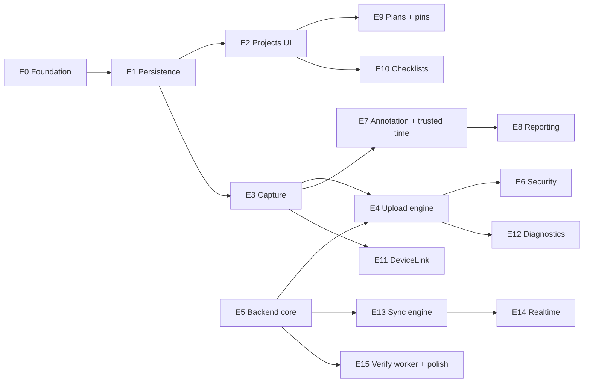

# 15 — Roadmap & task board

Twelve weeks, seven milestones, 217 cards. Card titles are ready to paste into Trello — one card
per line.

**Contents** — 1. [Notation](#1-notation) · 2. [Milestones](#2-milestones) · 3. [Epics](#3-epics) · 4. [Dependency order](#4-dependency-order) · 5. [Week by week](#5-week-by-week) · 6. [Trello board setup](#6-trello-board-setup) · 7. [Card titles](#7-card-titles) · 8. [Working rules](#8-working-rules)

## 1. Notation

Three codes appear throughout this document. They are different axes, not a hierarchy.

| Code | Means | Used for |
|---|---|---|
| `M0`–`M6` | **Milestone** — a demo that must run on a real device | Trello labels, schedule gates |
| `E0`–`E15` | **Epic** — a group of related cards, numbered by dependency order, not by week | Grouping in §7, the graph in §4 |
| `[00]`–`[15]` | **Spec document number** | Prefix on every card title, so a card links back to its document |

An epic can span two milestones, and a milestone always draws on several epics.

## 2. Milestones

Each milestone is a demo, not a checkbox. If it cannot be shown on a real device, it is not done.

| # | Milestone | Week | Gate |
|---|---|---|---|
| M0 | Scaffold | 1 | Every package builds standalone, CI green, zero warnings |
| M1 | Record offline | 2 | Project → 80 locations → photo captured and hashed, **in airplane mode** |
| M2 | Bytes land | 4 | 200 files reach R2, survive app kill and airplane mode · **TestFlight #1** |
| M3 | Deliverable | 6 | Signed, branded PDF + CSV exported from a real session |
| M4 | Field-ready | 8 | Plan pins, checklists, BLE mock, diagnostics · **TestFlight #2** |
| M5 | Multi-device | 10 | Second device sees the same data; deletes propagate |
| M6 | Polish | 12 | WebSocket, pre-record, TestFlight feedback closed |

M2 is the real one. Everything before it is setup; everything after it is addition.

## 3. Epics

| Epic | Name | Week | Cards | Spec |
|---|---|---|---:|---|
| E0 | Foundation — SPM scaffold, CI, logging, DI | 1 | 13 | [00](00-project-info.md) |
| E1 | Persistence — entities, SwiftData, migrations | 1–2 | 8 | [00](00-project-info.md) §3 |
| E2 | Projects, sessions, locations | 2 | 11 | [01](01-project-session.md) |
| E3 | Capture pipeline | 2, 5 | 15 | [02](02-capture.md) |
| E4 | Upload engine | 3–4 | 22 | [04](04-upload-engine.md) |
| E5 | Backend core | 3–4 | 16 | [14](14-backend.md) |
| E6 | Security & audit | 5–6 | 10 | [07](07-security.md) |
| E7 | Annotation & trusted time | 5–6 | 12 | [12](12-annotation.md) |
| E8 | Reporting | 6 | 18 | [05](05-reporting.md) |
| E9 | Floor plans & pins | 7 | 12 | [11](11-floorplan-pins.md) |
| E10 | Checklists | 7–8 | 10 | [13](13-checklists.md) |
| E11 | DeviceLink | 8 | 12 | [06](06-device-link.md) |
| E12 | Diagnostics | 8 | 9 | [09](09-diagnostics.md) |
| E13 | Sync engine | 9–10 | 17 | [08](08-auth-sync.md) · [14](14-backend.md) |
| E14 | Realtime channel | 11 | 11 | [10](10-realtime-progress.md) |
| E15 | Verification worker & polish | 11–12 | 9 | [14](14-backend.md) · [02](02-capture.md) |

Epic numbers follow **dependency order**, so E13 sits late because everything it syncs must exist
first — not because sync is unimportant.

## 4. Dependency order



| Rule | Reason |
|---|---|
| E5 starts in parallel with E4, not after | The upload engine cannot be tested without endpoints to call |
| E8 waits for E7 | The PDF renders the stamped, annotated derivative — not the raw file |
| E13 is the last big block | Single-device use needs no sync; it is the safest thing to defer |
| E14 depends on E13 | Both need the backend's job store and `pg_notify` |

## 5. Week by week

| Week | Focus | Ends with |
|---|---|---|
| 1 | E0 + start E1 | CI green, empty packages build |
| 2 | E1, E2, start E3 | **M1** — record a hashed photo offline |
| 3 | E4 + E5 in parallel | Single PUT works end to end |
| 4 | E4 + E5 | **M2** — multipart, resume, kill survival · TestFlight #1 |
| 5 | E6, E7 | Face ID, audit chain, annotation layer |
| 6 | E8 | **M3** — signed PDF + CSV |
| 7 | E9, start E10 | Pins on a real floor plan |
| 8 | E10, E11, E12 | **M4** — checklists, BLE mock, diagnostics · TestFlight #2 |
| 9 | E13 backend half | Migrations, pull/push endpoints |
| 10 | E13 client half | **M5** — two devices converge |
| 11 | E14, start E15 | WebSocket channel, verify worker |
| 12 | E15 | **M6** — pre-record, polish, submission prep |

**Slip plan:** if week 9 arrives and the upload engine is still shaky, cut E13 and E14 entirely and
ship single-device. The schema and endpoints already support adding sync later.

## 6. Trello board setup

### 6.1 Lists

| List | Purpose |
|---|---|
| Backlog | Everything not yet scheduled |
| This week | Pulled from Backlog on Monday; nothing else gets worked |
| In progress | **WIP limit 2** |
| Blocked | Must carry a comment saying what unblocks it |
| Review | Diff reviewed against the doc's Definition of done |
| Done | |

### 6.2 Labels

| Label | Meaning |
|---|---|
| `M0`…`M6` | Milestone |
| `never-cut` | Upload engine, hash + trusted time, PDF export |
| `backend` | Runs in `Backend/`, not the app |
| `test` | Test-only card |
| `device-only` | Cannot be verified on the simulator |
| `blocked-on-hardware` | Needs a real BLE meter |

### 6.3 Card conventions

- Title starts with the spec number in brackets, so every card links back to a document.
- Card description holds the acceptance line copied from that spec's Definition of done.
- A card is at most two days. If it is bigger, it is an epic and gets split.

## 7. Card titles

Paste each block into Trello's "Add a card" field — it creates one card per line.

### 7.1 Day 0 — accounts and access · `M0`

Start these **before** writing code. Apple enrollment alone can take days, and three E0 cards are
blocked until the accounts exist.

```
[00] Enroll in the Apple Developer Program
[00] Reserve the bundle identifier and create the App Store Connect record
[00] Create the Firebase project and download GoogleService-Info.plist
[00] Create Cloudflare R2 buckets for dev, staging and prod
[00] Create the Fly.io app and provision Postgres
[00] Store every secret in the GitHub Actions secret store
[00] Register a self-hosted macOS runner on the development Mac
[00] Split CI into ubuntu jobs and self-hosted macOS jobs
[00] Add .gitignore and a root README before the first Xcode-generated file
[00] Confirm a physical iPhone is available for background upload and BLE testing
```

| Blocks | Because |
|---|---|
| `Wire Crashlytics as startup step 1` | Needs `GoogleService-Info.plist` |
| `POST /uploads` and everything in E5 | Needs R2 buckets and credentials |
| TestFlight #1 at week 4 | Needs a completed Apple enrollment |

### 7.2 E0 — Foundation · `M0`

```
[00] Init SPM workspace with App target and 9 empty packages
[00] Declare package dependency graph and forbid cross-feature imports
[00] Add xcconfig for Debug, Staging, Release with feature flags
[00] Add SwiftLint and SwiftFormat configuration
[00] CI macOS: build every package standalone with warnings-as-errors
[00] CI macOS: run unit tests scoped per package
[00] CI: nightly job for the full suite and the Realtime boundary check
[00] CI ubuntu: fail the build on any print( in Sources
[00] CI ubuntu: assert Core imports no Apple frameworks beyond Foundation
[00] CI ubuntu: secret scan over the diff with gitleaks
[00] Wire Crashlytics as startup step 1
[00] Add AppLogger wrapper with per-module os.log categories
[00] Add AppDependencies container with an injected Clock
[00] Write guarded startup sequence, one log line per step
```

### 7.3 E1 — Persistence · `M1`

Declare **every** model in `SchemaV1`, including the ones whose features land in weeks 7–8. Empty
tables cost nothing; a migration against installed TestFlight builds does.

```
[00] Define Core entities as framework-free structs
[00] Define SwiftData models for Project, Session, Location
[00] Define SwiftData models for Capture, Issue, Annotation
[00] Declare PlanSheet, PlanPin and the four checklist models in SchemaV1 too
[00] Add SchemaV1 and SchemaMigrationPlan
[00] Add ModelActor for background writes
[00] Add relative-path resolver for Capture.fileURL
[00] Test: migration against a SchemaV1 fixture store
[00] Test: PersistentIdentifier crosses actors, models never do
```

### 7.4 E2 — Projects, sessions, locations · `M1`

```
[01] Project list and create screen
[01] Project detail with Sessions, Locations, Plans tabs
[01] Start, close and reopen a session
[01] Location tree view with 3 levels and drag reorder
[01] LocationTemplateSpec generator with preview
[01] Bulk-commit generated locations in one transaction
[01] Batched badge counts via fetchCount
[01] Cascade-delete confirmation showing concrete numbers
[01] Block project delete while captures are pending upload
[01] Test: template edge cases, depth cap, batch cap
[01] Test: closed session rejects addCapture
```

### 7.5 E3 — Capture pipeline · `M1` `never-cut`

```
[02] AVCaptureSession setup on a serial sessionQueue
[02] Preview layer as UIViewRepresentable
[02] Photo output with quality prioritisation
[02] Video and audio capture via AVAssetWriter
[02] Torch, zoom, camera flip, elapsed timer
[02] Capture state machine behind CaptureSessionControlling
[02] Handle session interruption and finalize in-flight recordings
[02] Streaming SHA-256 hasher over FileHandle chunks
[02] CLLocationManager with staleness rule and nil fallback
[02] Write media with completeUnlessOpen and exclude from backup
[02] Continuous capture with horizontal thumbnail strip
[02] Free-space and thermal-state guards before recording
[02] Test: hash matches shasum on a 200 MB file
[02] Test: interruption finalizes exactly once
[02] Test: stale location yields nil coordinates
```

### 7.6 E4 — Upload engine · `M2` `never-cut`

```
[04] Define UploadJobRecord and UploadPartRecord
[04] Define UploadStore protocol and InMemoryUploadStore
[04] Implement UploadStore over SwiftData in Persistence
[04] ChunkPlanner: single PUT below threshold, uniform parts above
[04] UploadStateMachine reduce and Effect types
[04] Failure classification from status codes
[04] Exponential backoff with jitter and injected RNG
[04] UploadCoordinator actor executing Effects
[04] Background URLSession configuration and delegate
[04] Key tasks on taskDescription, never taskIdentifier
[04] Cold-launch reconciliation across all three cases
[04] Temp part materialization and deletion on ETag
[04] Priority queue ordered by severity and kind
[04] WiFi-only toggle honouring allowsCellularAccess
[04] Dedupe by sha256 within a project
[04] Free-disk guard before planning a job
[04] MockTransport with scripted per-part responses
[04] Test: full state x event matrix, no cell skipped
[04] Test: urlExpired spends no retry budget
[04] Test: budget exhausted keeps the original file
[04] Test: cold-launch reconciliation, three cases
[04] Device test: kill the app mid-transfer and resume
```

### 7.7 E5 — Backend core · `M2` `backend` `never-cut`

```
[14] Init Fastify + TypeScript project with TypeBox validation
[14] Firebase ID token verification middleware with checkRevoked
[14] Key prefix and traversal validation
[14] Migration 0001_uploads with enums and constraints
[14] POST /uploads with single vs multipart mode selection
[14] POST /uploads/:id/parts/refresh
[14] POST /uploads/:id/complete, idempotent via coalesce
[14] DELETE /uploads/:id abort and cleanup
[14] Error contract: status codes mapped to client FailureReason
[14] Structured logging with no URLs, tokens or free text
[14] Rate limiting per uid on /uploads
[14] Provision R2 buckets and the 7-day multipart lifecycle rule
[14] Deploy to Fly.io with Postgres and connection cap tuning
[14] Test: signing a key outside the uid prefix is rejected
[14] Test: concurrent duplicate complete returns one identical body
[14] Test: aborted job cannot be completed
```

### 7.8 E6 — Security & audit · `M3`

```
[07] Keychain wrapper with SecAccessControl and biometryCurrentSet
[07] AuditEntry model and HMAC-SHA256 chain
[07] Async chain verification at startup
[07] Face ID gate on RootView with passcode fallback
[07] App-switcher content overlay
[07] Log redaction rules for all modules
[07] PrivacyInfo.xcprivacy declarations
[07] CI writes GoogleService-Info.plist from a secret
[07] Test: modifying a mid-chain entry is detected at the right index
[07] Test: log metadata contains no free text
```

### 7.9 E7 — Annotation & trusted time · `M3`

```
[12] AnnotationShape enum with Codable round-trip
[12] Annotation editor with arrow, box, circle, pen, text
[12] Undo and redo stack with a step cap
[12] Normalized coordinate rendering at any output size
[12] Stamped derivative generator with disk cache
[12] TrustedTimestamp with three confidence levels
[12] Server clock offset derived from the Date response header
[12] On-device dictation via SFSpeechRecognizer
[12] Voice note recorded as an ordinary audio capture
[12] Verification state display: registered, verified, not yet verified
[12] Test: annotating never mutates the original file hash
[12] Test: confidence across fresh offset, stale offset, clock jump
```

### 7.10 E8 — Reporting · `M3` `never-cut`

```
[05] SessionSnapshot single-fetch loader
[05] ReportLayoutEngine, pure and UIKit-free
[05] PDFPageRenderer with per-page autoreleasepool
[05] Image downsampling via CGImageSourceCreateThumbnailAtIndex
[05] Cover page with branding and client block
[05] Summary tables by severity, floor and assignee
[05] Issue detail blocks with annotated photos
[05] Before and after pair layout
[05] Stale-issue section
[05] Signature capture with PencilKit
[05] Footer with hash prefix, verification code and time confidence
[05] Hash-of-hashes final page
[05] CSV export streamed with FileHandle
[05] XLSX export above the row threshold
[05] Grouping switch: by location or by assignee
[05] Placeholder block for a capture whose file is missing
[05] Test: rendered image count equals input capture count
[05] Test: 200-image render peak memory under 200 MB
```

### 7.11 E9 — Floor plans & pins · `M4`

```
[11] PlanSheet and PlanPin models
[11] Import plans from PDF and image with page picker
[11] CATiledLayer renderer with on-disk tile cache
[11] Normalized coordinate conversion helpers
[11] Long-press pin drop opening the issue sheet
[11] Pin drag with confirm on release
[11] Pin clustering below the zoom threshold
[11] Pin to issue navigation both ways
[11] Plan pin map pages in the PDF
[11] Pin migration between sheet revisions
[11] Test: coordinates map to the same point at two render scales
[11] Test: A0 plan render peak memory under 150 MB
```

### 7.12 E10 — Checklists · `M4`

```
[13] ChecklistTemplate, TemplateItem, Run and Result models
[13] Seed eight built-in handover and structural templates
[13] Run screen with one tap per item
[13] Fail flows into a prefilled issue sheet
[13] Photo requirement on fail
[13] Resume an interrupted run
[13] Per-location checklist tables in the PDF
[13] Template JSON export and import with version check
[13] Test: editing a template does not alter completed runs
[13] Test: fail to pass resolves the generated issue
```

### 7.13 E11 — DeviceLink · `M4` `blocked-on-hardware`

```
[06] DeviceProfile protocol and DeviceReading model
[06] DeviceLinkManager as an actor over CBCentralManager
[06] Bosch GLM profile and byte parser
[06] Leica Disto profile
[06] Generic moisture profile showing raw bytes
[06] macOS mock peripheral tool with scripted measurements
[06] Reconnect with independent backoff
[06] Paired device identifiers persisted and restored
[06] Device reading overlay on the camera preview
[06] Staleness rule before attaching to a capture
[06] Test: parser against captured real byte arrays
[06] Test: disconnect during discovery returns to scanning
```

### 7.14 E12 — Diagnostics · `M4`

```
[09] Upload status screen separating waiting from failed
[09] Throughput-window time estimate
[09] Storage breakdown: synced, unsynced, reclaimable
[09] Integrity detectors for all seven conditions
[09] Controlled cleanup that never touches pending files
[09] Redacted diagnostic bundle export
[09] System status flags panel
[09] Test: redaction strips URLs, emails, free text, coordinates
[09] Test: cleanup with 12 pending files deletes none
```

### 7.15 E13 — Sync engine · `M5`

```
[14] Migration 0002_sync_core with the per-user rev counter
[14] Migration 0003_metadata with all entity tables and enums
[14] POST /sync/pull with tombstones and resyncRequired
[14] POST /sync/push with SQL-enforced last-write-wins
[14] Deferred constraints inside the push transaction
[14] Monotonic session state merge in SQL
[14] Nightly tombstone purge job
[14] DELETE /account removing R2 objects then rows
[08] MetadataSyncEngine actor with pull, push and full resync
[08] Mutation queue persisted in SwiftData
[08] Dependency-ordered push queue
[08] Adopt superseded rows returned by the server
[08] Account switch clears the queue and cancels jobs
[08] Test: tombstone applied locally does not resurrect
[08] Test: cursor past the purge window triggers full resync
[08] Test: 200 mutations push as one request
[08] Integration test: two devices converge
```

### 7.16 E14 — Realtime channel · `M6`

```
[14] WebSocket route with auth handshake and timeout
[14] Snapshot response on subscribe
[14] pg_notify fan-out with a dedicated LISTEN connection
[10] RealtimeChannel actor with re-armed receive
[10] Ping and pong with dead-connection detection
[10] Reconnect backoff with jitter
[10] Event to UploadStore reconciliation, forward-only
[10] Compare server sha256 against the local hash before trusting
[10] Feature flag to disable the channel entirely
[10] CI job: remove Realtime from Package.swift and still build
[10] Test: snapshot applies only forward transitions
```

### 7.17 E15 — Verification worker & polish · `M6`

```
[14] Async verification worker reading objects back from R2
[14] registered to verified transition and mismatch handling
[14] GET /verify/:code public endpoint with enumeration defence
[02] Pre-record ring buffer with three-second segments
[02] Ring buffer join via AVMutableComposition
[02] Standalone audio capture
[00] TestFlight feedback triage pass
[00] App Store privacy answers and screenshots
[00] Final zero-warning sweep across all packages
```

## 8. Working rules

| Rule | Reason |
|---|---|
| WIP limit 2 | Two half-finished features cost more than one finished one |
| Pull only from **This week** | The backlog is a plan, not a menu |
| A card is done when its spec's Definition of done passes | The docs already wrote the acceptance criteria |
| Test cards are not optional and not batched to the end | Retrofitting tests onto frozen code costs double |
| `device-only` cards get a real device before the milestone closes | The simulator hides thermal, disk and background behaviour |
| Ship TestFlight at M2 and M4 | Feedback on a half-built app is still feedback |
