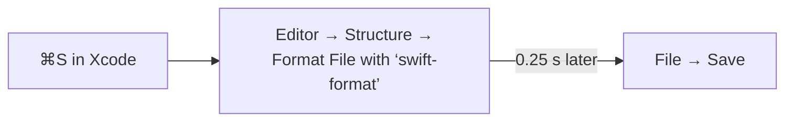

# Format-on-save for SwiftUI in Xcode

A Hammerspoon ⌘S hotkey, active only while Xcode is frontmost, runs `swift-format` on the current file and then saves.



## 1. Format rule

The rule lives in [`.swift-format`](../../.swift-format) at the repo root and is committed to git.

| Task | Command |
|---|---|
| Regenerate defaults (Xcode 16+ toolchain) | `swift format dump-configuration > .swift-format` |
| Regenerate defaults (Homebrew binary) | `swift-format dump-configuration > .swift-format` |
| Check which form works | `swift format --help` |

Key values currently set:

| Key | Value | Why |
|---|---|---|
| `lineLength` | `100` | Shared line limit; SwiftLint's `line_length` is disabled so they don't conflict |
| `indentation.spaces` | `4` | Xcode default |
| `respectsExistingLineBreaks` | `true` | Keeps multi-line SwiftUI modifier chains from collapsing |
| `lineBreakBeforeEachArgument` | `false` | Arguments stay on one line when they fit |
| `multiElementCollectionTrailingCommas` | `true` | Cleaner diffs |
| `orderedImports` / `OrderedImports` | on | Imports sorted alphabetically |

## 2. Install Hammerspoon

```bash
brew install --cask hammerspoon
```

| Permission | Why |
|---|---|
| Accessibility (prompted on first launch) | Lets Hammerspoon trigger Xcode menu items |

## 3. Find the exact Xcode menu item

`selectMenuItem` matches strings exactly, and Xcode renders the title with curly quotes (`‘swift-format’`, U+2018/U+2019).

| Step | Action |
|---|---|
| 1 | Focus a `.swift` file in Xcode |
| 2 | Press **⌘⌥D** (the `xcodeDebug` hotkey from step 4) |
| 3 | Open Hammerspoon menu-bar icon → **Console** |
| 4 | Copy the string from a line like `xcodeDebug: Structure > Format File with ‘swift-format’ \| enabled = true` |
| 5 | If it differs from the one in [`hammerspoon-init.lua`](hammerspoon-init.lua), paste it into the `selectMenuItem` call |

Verified on Xcode 27 / Swift 6.4.

## 4. Hammerspoon config

```bash
cp docs/dev-docs/hammerspoon-init.lua ~/.hammerspoon/init.lua
```

| Global in [`hammerspoon-init.lua`](hammerspoon-init.lua) | Role |
|---|---|
| `xcodeSave` | ⌘S hotkey: format menu item, then **File → Save** after 0.25 s |
| `xcodeDebug` | ⌘⌥D hotkey: prints every **Editor → Structure** item to the Console |
| `xcodeWatcher` | Enables `xcodeSave` when Xcode activates, disables it when Xcode deactivates |

Gotchas:

| Symptom | Cause / fix |
|---|---|
| ⌘S does nothing right after reloading config | Xcode was already frontmost; switch away and back once |
| `selectMenuItem` fails when typed in the Console | The Console is frontmost, not Xcode; test only via a hotkey |
| Console noise from `print(...)` | Safe to remove; `format menu selected = true` / `save menu selected = true` confirm it works |
| Format item not found after an Xcode update | Re-run ⌘⌥D and update the string |

## 5. Load the config

| Step | Action |
|---|---|
| 1 | Hammerspoon menu-bar icon → **Reload Config** |
| 2 | Enable **Launch at Login** |
