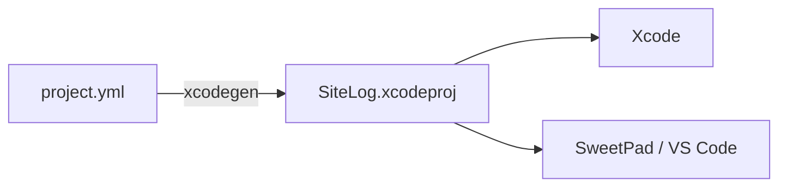

# XcodeGen

`SiteLog.xcodeproj` is generated from [`project.yml`](../../project.yml). Edit the YAML, never the
`.pbxproj` by hand.



## Install

```bash
brew install xcodegen
```

## Regenerate

| When | Action |
|---|---|
| After changing `project.yml` | `xcodegen` |
| After pulling, if `project.yml` changed | `xcodegen` |
| Adding or removing files in VS Code | Automatic: `sweetpad.xcodegen.autogenerate` is on |
| Adding files in Xcode | Nothing: `SiteLog/` is a synced folder |

Close the project in Xcode before regenerating, or Xcode may keep the old one in memory.

## What `project.yml` owns

| Area | Where |
|---|---|
| Team, versions, Swift 6 concurrency flags | `settings.base` |
| `Core` (local) and `Inject` (remote) packages | `packages` |
| App target, bundle id, iOS 18.6 | `targets.SiteLog` |
| SwiftLint build phase | `targets.SiteLog.postBuildScripts` |
| Hot reload flags, Debug only | `targets.SiteLog.settings.configs.Debug` — see [hot-reload.md](hot-reload.md) |
| Shared `SiteLog` scheme, `INJECTION_PROJECT_ROOT` | `schemes.SiteLog` |

The generated `.xcodeproj` stays committed so the repo opens in Xcode without running XcodeGen first.
